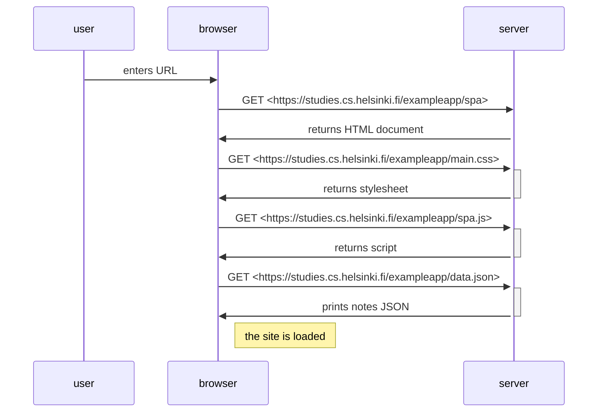

# Single Page App

```mermaid
sequenceDiagram;
    user->>browser: enters URL
    browser->>server: GET <https://studies.cs.helsinki.fi/exampleapp/spa>;
    activate server;
    server->>browser: returns HTML document;

    browser->>server: GET <https://studies.cs.helsinki.fi/exampleapp/main.css>
    activate server;
    server->>browser: returns stylesheet;
    deactivate server;

    browser->>server: GET <https://studies.cs.helsinki.fi/exampleapp/spa.js>;
    activate server;
    server->>browser: returns script;
    deactivate server;

    browser->>server: GET <https://studies.cs.helsinki.fi/exampleapp/data.json>;
    activate server;
    server->>browser: prints notes JSON;
    deactivate server;

    Note right of browser: the site is loaded;

```
