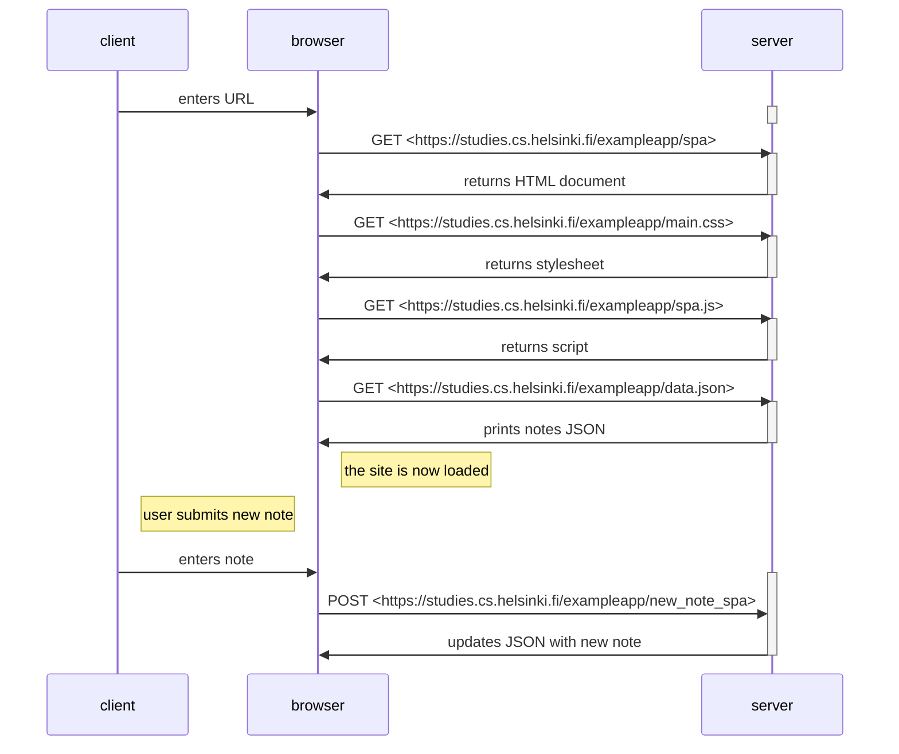

# Creating note on Single Page App

```mermaid
sequenceDiagram;

    client->>browser: enters URL
    activate server;
    deactivate server;

    browser->>server: GET <https://studies.cs.helsinki.fi/exampleapp/spa>;
    activate server;
    server->>browser: returns HTML document;
    deactivate server;

    browser->>server: GET <https://studies.cs.helsinki.fi/exampleapp/main.css>
    activate server;
    server->>browser: returns stylesheet;
    deactivate server;

    browser->>server: GET <https://studies.cs.helsinki.fi/exampleapp/spa.js>;
    activate server;
    server->>browser: returns script;
    deactivate server;

    browser->>server: GET <https://studies.cs.helsinki.fi/exampleapp/data.json>;
    activate server;
    server->>browser: prints notes JSON;
    deactivate server;

    Note right of browser: the site is now loaded;

    Note left of browser: user submits new note;

    client->>browser: enters note
    activate server;
    browser->>server: POST <https://studies.cs.helsinki.fi/exampleapp/new_note_spa>;
    server->>browser: updates JSON with new note;
    deactivate server;

```
